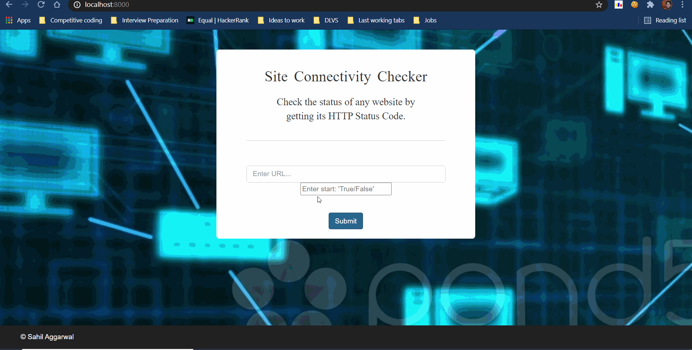

# Site Connectivity Checker

The main objective of this project is to check the status of sites. 

We  can add commands to allow users to add and remove sites from the list of sites to be checked.(Done)

The users should also be able to start the tool, stop it, and determine the intervals(Done)

